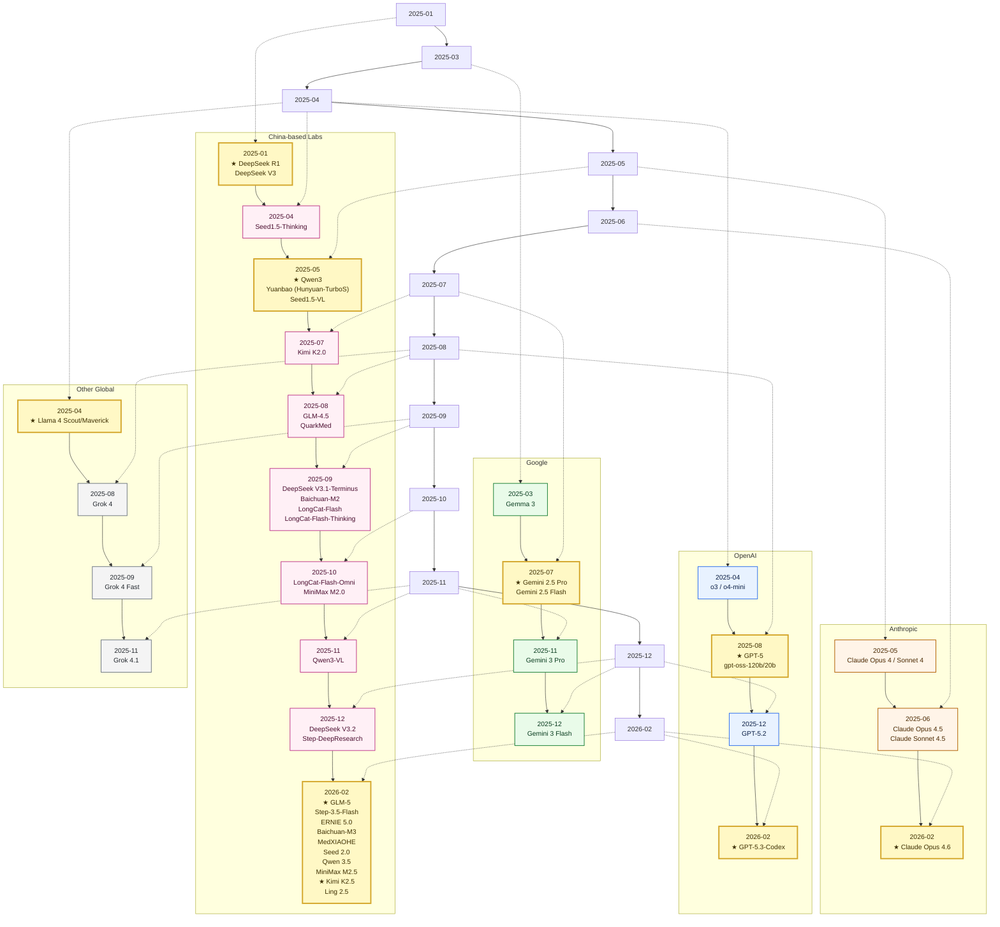

# Awesome LLM Technical Reports (2025-01 ~ 2026-02)

> A curated, structured local archive of frontier LLM / multimodal / medical-vertical model documentation — papers, system cards, model cards, and official blog posts — organized by **year / company**.

  
  
  
  
  

---

## Table of Contents

- [Project Scope](#project-scope)
- [Release Timeline](#release-timeline)
- [Company Quick Links](#company-quick-links)
- [Model Index (Folded by Year)](#model-index-folded-by-year)
- [Star History](#star-history)

## Project Scope

- Systematically archives major model releases from **January 2025** to **February 2026** across LLM, multimodal, and medical-vertical domains.
- Downloads official papers, system cards, model cards as local PDFs; exports web-only blog pages to PDF via headless browser.
- Provides a single searchable Markdown index sorted in reverse chronological order.

## Release Timeline

**Legend (Camp Colors):** `OpenAI` · `Anthropic` · `Google` · `China-based Labs` · `Other Global`  
**Impact Highlight:** nodes with **★** are ecosystem-shaping releases (community discussion, benchmark influence, or deployment adoption).

<b>Monthly Density Snapshot</b>

```mermaid
%%{init: {
  "theme": "base",
  "themeVariables": {
    "background": "#ffffff",
    "primaryColor": "#f8fafc",
    "primaryTextColor": "#000000",
    "lineColor": "#64748b",
    "fontFamily": "Segoe UI, Arial, sans-serif"
  }
}}%%
flowchart LR
  M1(("25-01<br/>R02")) --> M2(("25-03<br/>R01")) --> M3(("25-04<br/>R03")) --> M4(("25-05<br/>R04")) --> M5(("25-06<br/>R03")) --> M6(("25-07<br/>R03")) --> M7(("25-08<br/>R05")) --> M8(("25-09<br/>R05")) --> M9(("25-10<br/>R02")) --> M10(("25-11<br/>R03")) --> M11(("25-12<br/>R04")) --> M12(("26-02<br/>R12"))

  classDef b1 fill:#f8fafc,stroke:#94a3b8,stroke-width:1px,color:#000000,font-size:10px;
  classDef b2 fill:#eef2ff,stroke:#818cf8,stroke-width:1.5px,color:#000000,font-size:12px;
  classDef b3 fill:#dbeafe,stroke:#3b82f6,stroke-width:2px,color:#000000,font-size:14px;
  classDef b4 fill:#bfdbfe,stroke:#2563eb,stroke-width:3px,color:#000000,font-size:16px;
  classDef b5 fill:#a5b4fc,stroke:#4f46e5,stroke-width:4px,color:#000000,font-size:19px;
  classDef b12 fill:#6366f1,stroke:#312e81,stroke-width:6px,color:#000000,font-size:24px;

  class M2 b1;
  class M1,M9 b2;
  class M3,M5,M6,M10 b3;
  class M4,M11 b4;
  class M7,M8 b5;
  class M12 b12;
```

> Bubbles show month + release count from the model index table.

## Company Quick Links

`2026`: [`Zhipu AI`](#company-zhipu) · [`StepFun`](#company-stepfun) · [`Baidu`](#company-baidu) · [`Baichuan`](#company-baichuan) · [`ByteDance`](#company-bytedance) · [`OpenAI`](#company-openai) · [`Anthropic`](#company-anthropic) · [`Alibaba`](#company-alibaba_qwen) · [`MiniMax`](#company-minimax) · [`Moonshot AI`](#company-moonshot) · [`InclusionAI`](#company-inclusionai)

`2025`: [`DeepSeek`](#company-deepseek) · [`Google`](#company-google) · [`xAI`](#company-xai) · [`Meituan`](#company-meituan) · [`Meta`](#company-meta) · [`Quark`](#company-quark) · [`Tencent`](#company-tencent) (plus shared companies above)

### Company Directory Index

- **OpenAI**: `2025/openai/`, `2026/openai/`

- **Anthropic**: `2025/anthropic/`, `2026/anthropic/`

- **Google**: `2025/google/`

- **Meta**: `2025/meta/`

- **xAI**: `2025/xai/`

- **DeepSeek**: `2025/deepseek/`

- **Alibaba / Qwen**: `2025/alibaba_qwen/`, `2026/alibaba_qwen/`

- **Zhipu AI**: `2025/zhipu/`, `2026/zhipu/`

- **Moonshot AI**: `2025/moonshot/`, `2026/moonshot/`

- **MiniMax**: `2025/minimax/`, `2026/minimax/`

- **StepFun**: `2025/stepfun/`, `2026/stepfun/`

- **Baidu**: `2025/baidu/`, `2026/baidu/`

- **Baichuan Intelligence**: `2025/baichuan/`, `2026/baichuan/`

- **InclusionAI (Ant Group)**: `2026/inclusionai/`

- **ByteDance**: `2025/bytedance/`, `2026/bytedance/`

- **Tencent**: `2025/tencent/`

- **Meituan**: `2025/meituan/`

- **Quark (Alibaba)**: `2025/quark/`

## Model Index (Folded by Year)

<b>2026 (12 models)</b>

| Release Date | Organization | Model | Core Highlights (from PDF) | Official Link | Local File |
| --- | --- | --- | --- | --- | --- |
| 2026-02 | Zhipu AI | GLM-5 | Next-generation foundation model designed for agentic engineering; adopts DSA (DeepSeek Sparse Attention) on top of MoE 744B/40B with async RL to strengthen reasoning, coding, and agent capabilities. | https://arxiv.org/pdf/2602.15763 | 2026/zhipu/2026-02_glm-5.pdf |
| 2026-02 | StepFun | Step-3.5-Flash | Sparse MoE model (196B/11B) bridging frontier agentic intelligence with computational efficiency; combines sliding-window and full attention for sharp reasoning and fast reliable execution. | https://arxiv.org/pdf/2602.10604 | 2026/stepfun/2026-02_step-3.5-flash.pdf |
| 2026-02 | Baidu | ERNIE 5.0 | Natively autoregressive foundation model for unified multimodal understanding and generation across text, image, video, and audio; trained under a next-group-of-tokens prediction objective with ultra-sparse MoE. | https://arxiv.org/pdf/2602.04705 | 2026/baidu/2026-02_ernie-5.0.pdf |
| 2026-02 | Baichuan Intelligence | Baichuan-M3 | Medical-enhanced LLM shifting from passive QA to active clinical-grade decision support; utilizes specialized active information acquisition for open-ended consultations with long-horizon reasoning. | https://arxiv.org/pdf/2602.06570 | 2026/baichuan/2026-02_baichuan-m3.pdf |
| 2026-02 | ByteDance | MedXIAOHE | Medical vision-language foundation model achieving SOTA across diverse medical benchmarks; features entity-aware pretraining, tool-augmented clinical reasoning, and surpasses leading commercial models. | https://arxiv.org/pdf/2602.12705 | 2026/bytedance/2026-02_medxiaohe.pdf |
| 2026-02 | OpenAI | GPT-5.3-Codex | Cloud-based agentic coding model powered by codex-1 (optimized o3); designed for long-horizon software engineering tasks with full tool capabilities in sandboxed environments. | https://cdn.openai.com/pdf/8df7697b-c1b2-4222-be00-1fd3298f351d/codex_system_card.pdf | 2026/openai/2026-02_gpt-5.3-codex.pdf |
| 2026-02 | Anthropic | Claude Opus 4.6 | Frontier model with strong software engineering, agentic tasks, and long-context reasoning; system card covers financial analysis, document comprehension, and extensive safety evaluations. | https://www-cdn.anthropic.com/14e4fb01875d2a69f646fa5e574dea2b1c0ff7b5.pdf | 2026/anthropic/2026-02_claude-opus-4.6.pdf |
| 2026-02 | ByteDance | Seed 2.0 | LLM series targeting real-world complexity and enterprise workflows; model card describes capabilities across professional and personal contexts with emphasis on practical task completion. | https://lf3-static.bytednsdoc.com/obj/eden-cn/lapzild-tss/ljhwZthlaukjlkulzlp/seed2/0214/Seed2.0%20Model%20Card.pdf | 2026/bytedance/2026-02_seed-2.0.pdf |
| 2026-02 | Alibaba | Qwen 3.5 | Native vision-language model (397B-A17B) for multi-agent workflows; first open-weight model in the Qwen3.5 series with native multimodal capabilities and enhanced agent coordination. | https://qwen.ai/blog?id=qwen3.5 | 2026/alibaba_qwen/2026-02_qwen-3.5.pdf |
| 2026-02 | MiniMax | MiniMax M2.5 | Extensively RL-trained frontier model; SOTA in coding (80.2% SWE-Bench Verified), agentic tool use, and search; 37% faster than M2.1 at 100 tok/s with costs as low as $1/hour continuous operation. | https://www.minimax.io/news/minimax-m25 | 2026/minimax/2026-02_minimax-m2.5.pdf |
| 2026-02 | Moonshot AI | Kimi K2.5 | Open-source multimodal agentic model (1T MoE) jointly optimizing text and vision; features Agent Swarm for parallel sub-task execution and emphasizes mutual enhancement between modalities. | https://github.com/MoonshotAI/Kimi-K2.5/raw/master/tech_report.pdf | 2026/moonshot/2026-02_kimi-k2.5.pdf |
| 2026-02 | InclusionAI (Ant Group) | Ling 2.5 | 1T total / 63B active parameters with hybrid linear attention; supports up to 1M context via YaRN, features composite reward RL for efficiency-performance balance, and is compatible with mainstream agent platforms. | https://github.com/inclusionAI/Ling-V2.5 | 2026/inclusionai/2026-02_ling-2.5.pdf |

<b>2025 (35 models)</b>

| Release Date | Organization | Model | Core Highlights (from PDF) | Official Link | Local File |
| --- | --- | --- | --- | --- | --- |
| 2025-12 | OpenAI | GPT-5.2 | Iterative update to GPT-5 system card; covers enhanced safety evaluations, disallowed-content testing, and Preparedness Framework capability assessments for the GPT-5.2 release. | https://cdn.openai.com/pdf/3a4153c8-c748-4b71-8e31-aecbde944f8d/oai_5_2_system-card.pdf | 2025/openai/2025-12_gpt-5.2.pdf |
| 2025-12 | DeepSeek | DeepSeek V3.2 | Harmonizes high computational efficiency with superior reasoning and agent performance; introduces DeepSeek Sparse Attention (DSA) and scalable RL framework for improved long-context capabilities. | https://arxiv.org/pdf/2512.02556 | 2025/deepseek/2025-12_deepseek-v3.2.pdf |
| 2025-12 | Google | Gemini 3 Flash | High-efficiency multimodal model card; covers known limitations, mitigation approaches, and safety performance for the Gemini 3 Flash release with long-context support. | https://storage.googleapis.com/deepmind-media/Model-Cards/Gemini-3-Flash-Model-Card.pdf | 2025/google/2025-12_gemini-3-flash.pdf |
| 2025-12 | StepFun | Step-DeepResearch | Autonomous deep-research agent; addresses limitations of academic multi-hop search benchmarks like BrowseComp by targeting real-world long-horizon research tasks with LLM-driven planning. | https://arxiv.org/pdf/2512.20491 | 2025/stepfun/2025-12_step-deepresearch.pdf |
| 2025-11 | Google | Gemini 3 Pro | Model card for Gemini 3 Pro covering complex reasoning and agentic workflow capabilities; includes known limitations, mitigation approaches, and safety performance documentation. | https://storage.googleapis.com/deepmind-media/Model-Cards/Gemini-3-Pro-Model-Card.pdf | 2025/google/2025-11_gemini-3-pro.pdf |
| 2025-11 | xAI | Grok 4.1 | Iterative update to Grok 4 model card with continued safety evaluation coverage. | https://data.x.ai/2025-11-17-grok-4-1-model-card.pdf | Download failed |
| 2025-11 | Alibaba | Qwen3-VL | Most capable vision-language model in the Qwen series; natively supports interleaved contexts up to 256K tokens, seamlessly integrating text, images, and video for multimodal reasoning. | https://arxiv.org/pdf/2511.21631 | 2025/alibaba_qwen/2025-11_qwen3-vl.pdf |
| 2025-10 | Meituan | LongCat-Flash-Omni | Open-source omni-modal 560B model (27B activated) optimized for low-latency real-time audio-visual interaction; uses curriculum-inspired progressive multimodal training with modality-decoupled parallelism sustaining over 90% of text-only training throughput. | https://arxiv.org/pdf/2511.00279 | 2025/meituan/2025-10_longcat-flash-omni.pdf |
| 2025-10 | MiniMax | MiniMax M2.0 | Compact MoE model (230B total / 10B active) built for elite coding and agentic workflows; ranks #1 among open-source models on Artificial Analysis composite score with strong tool-use performance. | https://github.com/MiniMax-AI/MiniMax-M2 | 2025/minimax/2025-10_minimax-m2.0.pdf |
| 2025-09 | xAI | Grok 4 Fast | Low-latency inference variant of Grok 4 with safety evaluation coverage. | https://data.x.ai/2025-09-19-grok-4-fast-model-card.pdf | Download failed |
| 2025-09 | DeepSeek | DeepSeek V3.1-Terminus | Engineering iteration of V3 (MoE 671B/37B); adopts Multi-head Latent Attention (MLA) and DeepSeekMoE architectures for efficient inference and cost-effective training. | https://arxiv.org/pdf/2412.19437 | 2025/deepseek/2025-09_deepseek-v3.1-terminus.pdf |
| 2025-09 | Baichuan Intelligence | Baichuan-M2 | Medical LLM addressing the gap between static benchmark performance and real-world clinical conversational reasoning; features a verification system for reliable healthcare applications. | https://arxiv.org/pdf/2509.02208 | 2025/baichuan/2025-09_baichuan-m2.pdf |
| 2025-09 | Meituan | LongCat-Flash | 560B MoE language model designed for computational efficiency and agentic capabilities; introduces Zero-computation Experts and novel routing for scalable inference. | https://arxiv.org/pdf/2509.01322 | 2025/meituan/2025-09_longcat-flash.pdf |
| 2025-09 | Meituan | LongCat-Flash-Thinking | Efficient 560B MoE reasoning model built on LongCat-Flash; cultivated through long CoT data cold-start and curriculum RL for formal and agentic reasoning. | https://arxiv.org/pdf/2509.18883 | 2025/meituan/2025-09_longcat-flash-thinking.pdf |
| 2025-08 | Zhipu AI | GLM-4.5 | Open-source MoE LLM (355B total / 32B active) with hybrid reasoning supporting both thinking and direct response modes; trained on 23T tokens with comprehensive alignment. | https://arxiv.org/pdf/2508.06471 | 2025/zhipu/2025-08_glm-4.5.pdf |
| 2025-08 | OpenAI | GPT-5 | Unified system card covering multi-model routing architecture and comprehensive safety evaluations across the GPT-5 model family including reasoning and tool-use capabilities. | https://cdn.openai.com/pdf/8124a3ce-ab78-4f06-96eb-49ea29ffb52f/gpt5-system-card-aug7.pdf | 2025/openai/2025-08_gpt-5.pdf |
| 2025-08 | OpenAI | gpt-oss-120b/20b | Apache 2.0 open-weight MoE models (120B and 20B); model card covers architecture, quantization, and post-training for reasoning and tool use. | https://cdn.openai.com/pdf/419b6906-9da6-406c-a19d-1bb078ac7637/oai_gpt-oss_model_card.pdf | 2025/openai/2025-08_gpt-oss-120b-20b.pdf |
| 2025-08 | Quark (Alibaba) | QuarkMed | Medical foundation model trained on 1T healthcare tokens with verifiable RL pipeline; technical report covers clinical reasoning, safety, and multi-task medical benchmarks. | https://arxiv.org/pdf/2508.11894 | 2025/quark/2025-08_quarkmed.pdf |
| 2025-08 | xAI | Grok 4 | High-capability reasoning and tool-use model card with 256K context and comprehensive safety evaluation. | https://data.x.ai/2025-08-20-grok-4-model-card.pdf | Download failed |
| 2025-07 | Moonshot AI | Kimi K2.0 | MoE LLM with 1T total / 32B active parameters; proposes MuonClip optimizer with QK-clip technique to address training instability while enabling efficient large-scale agentic training. | https://arxiv.org/pdf/2507.20534 | 2025/moonshot/2025-07_kimi-k2.0.pdf |
| 2025-07 | Google | Gemini 2.5 Pro | Native multimodal MoE Transformer model card with 1M context; covers known limitations, mitigation approaches, and safety performance for the Gemini 2.5 Pro release. | https://storage.googleapis.com/deepmind-media/Model-Cards/Gemini-2-5-Pro-Model-Card.pdf | 2025/google/2025-07_gemini-2.5-pro.pdf |
| 2025-07 | Google | Gemini 2.5 Flash | High-efficiency reasoning model card with 1M context and native audio/image capabilities; balances long-context performance with low-latency inference. | https://storage.googleapis.com/deepmind-media/Model-Cards/Gemini-2-5-Flash-Model-Card.pdf | 2025/google/2025-07_gemini-2.5-flash.pdf |
| 2025-06 | Anthropic | Claude Opus 4.5 | System card covering frontier capabilities in software engineering, tool use, and computer use; details a wide range of pre-deployment safety evaluations. | https://assets.anthropic.com/m/64823ba7485345a7/Claude-Opus-4-5-System-Card.pdf | 2025/anthropic/2025-06_claude-opus-4.5.pdf |
| 2025-06 | Anthropic | Claude Sonnet 4.5 | Hybrid reasoning LLM system card with strengths in coding, agentic tasks, and computer use; details extensive evaluations for safety and alignment. | https://assets.anthropic.com/m/12f214efcc2f457a/original/Claude-Sonnet-4-5-System-Card.pdf | 2025/anthropic/2025-06_claude-sonnet-4.5.pdf |
| 2025-06 | Baidu | ERNIE 4.5 | Family of 10 large-scale foundation models including heterogeneous MoE variants (424B total / 47B active) and dense models; covers multimodal understanding and generation with industrial-scale training. | https://yiyan.baidu.com/blog/publication/ERNIE_Technical_Report.pdf | 2025/baidu/2025-06_ernie-4.5.pdf |
| 2025-05 | Alibaba | Qwen3 | Latest Qwen LLM series with unified thinking framework supporting both thinking and non-thinking modes; designed for improved performance, efficiency, and multilingual capabilities. | https://arxiv.org/pdf/2505.09388 | 2025/alibaba_qwen/2025-05_qwen3.pdf |
| 2025-05 | Tencent | Yuanbao (Hunyuan-TurboS) | Novel large hybrid Transformer-Mamba MoE model synergistically combining Mamba's long-sequence efficiency with Transformer's contextual understanding and adaptive CoT reasoning. | https://arxiv.org/pdf/2505.15431 | 2025/tencent/2025-05_yuanbao-hunyuan-turbos.pdf |
| 2025-05 | ByteDance | Seed1.5-VL | Vision-language foundation model (MoE 20B active / 532M vision encoder) designed for general-purpose multimodal understanding and reasoning with enhanced visual capabilities. | https://arxiv.org/pdf/2505.07062 | 2025/bytedance/2025-05_seed1.5-vl.pdf |
| 2025-05 | Anthropic | Claude Opus 4 / Sonnet 4 | System card introducing two hybrid reasoning LLMs; covers pre-deployment safety tests per Responsible Scaling Policy and comprehensive alignment evaluations. | https://www-cdn.anthropic.com/4263b940cabb546aa0e3283f35b686f4f3b2ff47.pdf | 2025/anthropic/2025-05_claude-opus-4-sonnet-4.pdf |
| 2025-04 | OpenAI | o3 / o4-mini | Reasoning models combining state-of-the-art reasoning with full tool capabilities — web browsing, Python, image analysis, image generation, canvas, automations, file search, and memory. | https://cdn.openai.com/pdf/2221c875-02dc-4789-800b-e7758f3722c1/o3-and-o4-mini-system-card.pdf | 2025/openai/2025-04_o3-o4-mini.pdf |
| 2025-04 | Meta | Llama 4 Scout/Maverick | First natively multimodal models in the Llama 4 herd; Scout features 10M token context with MoE architecture, Maverick optimized for quality and speed, both distilled from Llama 4 Behemoth. | https://ai.meta.com/blog/llama-4-multimodal-intelligence/ | 2025/meta/2025-04_llama-4-scout-maverick.pdf |
| 2025-04 | ByteDance | Seed1.5-Thinking | RL-driven reasoning model (MoE 200B/20B active) achieving 86.7 on AIME 2024, 55.0 on Codeforces, and 77.3 on GPQA, demonstrating excellent reasoning through thinking before responding. | https://arxiv.org/pdf/2504.13914 | 2025/bytedance/2025-04_seed1.5-thinking.pdf |
| 2025-03 | Google | Gemma 3 | Open multimodal model family (1B–27B) introducing vision understanding, wider language coverage, and improved deployment efficiency for the Gemma series. | https://arxiv.org/pdf/2503.19786 | 2025/google/2025-03_gemma-3.pdf |
| 2025-01 | DeepSeek | DeepSeek R1 | Pioneering pure RL approach to eliciting reasoning capabilities in LLMs; open-sources distillation recipes demonstrating that strong reasoning can emerge without supervised fine-tuning on CoT data. | https://arxiv.org/pdf/2501.12948 | 2025/deepseek/2025-01_deepseek-r1.pdf |
| 2025-01 | DeepSeek | DeepSeek V3 | Strong MoE language model (671B total / 37B active) adopting Multi-head Latent Attention (MLA) and DeepSeekMoE architectures for efficient inference and cost-effective training. | https://arxiv.org/pdf/2412.19437 | 2025/deepseek/2025-01_deepseek-v3.pdf |

## Star History

<a href="https://star-history.com/#joe1chief/awesome-llm-tech-reports&Date">
 <picture>
   <source media="(prefers-color-scheme: dark)" srcset="https://api.star-history.com/svg?repos=joe1chief/awesome-llm-tech-reports&type=Date&theme=dark" />
   <source media="(prefers-color-scheme: light)" srcset="https://api.star-history.com/svg?repos=joe1chief/awesome-llm-tech-reports&type=Date" />
   
 </picture>
</a>
