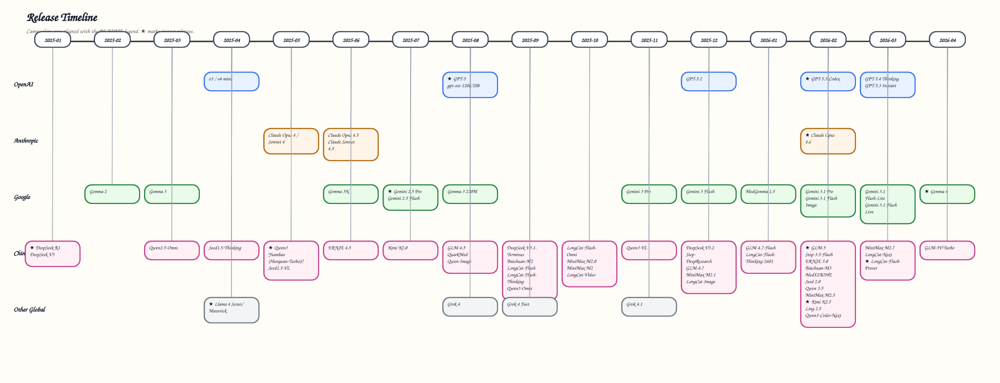
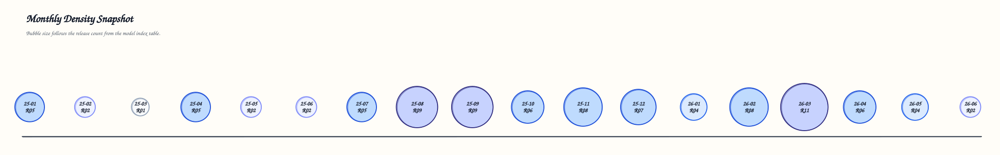

# Awesome LLM Technical Reports (2025-01 ~ 2026-07)

> A curated, structured local archive of frontier LLM / multimodal / medical-vertical model documentation — papers, system cards, model cards, and official blog posts — organized by **year / company**.

  
  
  
  
  

---

## Table of Contents

- [Project Scope](#project-scope)
- [Release Timeline](#release-timeline)
- [Company Quick Links](#company-quick-links)
- [Model Index (Folded by Year)](#model-index-folded-by-year)
- [Star History](#star-history)

## Project Scope

- Systematically archives major model releases from **January 2025** to **July 2026** across LLM, multimodal, and medical-vertical domains.
- Downloads official papers, system cards, model cards as local PDFs; exports web-only blog pages to PDF via headless browser.
- Provides a single searchable Markdown index sorted in reverse chronological order.

## Release Timeline

**Legend (Camp Colors):** `OpenAI` · `Anthropic` · `Google` · `China-based Labs` · `Other Global`  
**Impact Highlight:** nodes with **★** are ecosystem-shaping releases (community discussion, benchmark influence, or deployment adoption).

<b>Monthly Density Snapshot</b>

> Bubble size follows the release count from the model index table.

## Company Quick Links

`2026`: [`Meituan`](#company-meituan) · [`Google`](#company-google) · [`Zhipu AI`](#company-zhipu) · [`Anthropic`](#company-anthropic) · [`OpenAI`](#company-openai) · [`OpenBMB`](#company-openbmb) · [`Tencent`](#company-tencent) · [`MiniMax`](#company-minimax) · [`NVIDIA`](#company-nvidia) · [`Microsoft`](#company-microsoft) · [`InternLM`](#company-internlm) · [`InclusionAI (Ant Group)`](#company-inclusionai) · [`Snowflake`](#company-snowflake) · [`ByteDance`](#company-bytedance) · [`Moonshot AI`](#company-moonshot)

`2025`: [`StepFun`](#company-stepfun) · [`Zhipu AI`](#company-zhipu) · [`MiniMax`](#company-minimax) · [`Meituan`](#company-meituan) · [`Allen AI`](#company-allenai) · [`Alibaba`](#company-alibaba_qwen) · [`Google`](#company-google) · [`NVIDIA`](#company-nvidia) · [`xAI`](#company-xai) · [`OpenAI`](#company-openai) · [`Anthropic`](#company-anthropic) · [`Tencent`](#company-tencent) · [`InternLM`](#company-internlm) · [`Hugging Face`](#company-huggingface) · [`Quark`](#company-quark) · [`Moonshot AI`](#company-moonshot) · [`ByteDance`](#company-bytedance) · [`Meta`](#company-meta) · [`DeepSeek`](#company-deepseek)

### Company Directory Index

- **Alibaba / Qwen**: `2025/alibaba_qwen/`

- **Allen AI**: `2025/allenai/`

- **Anthropic**: `2025/anthropic/`, `2026/anthropic/`

- **ByteDance**: `2025/bytedance/`, `2026/bytedance/`

- **DeepSeek**: `2025/deepseek/`

- **Google**: `2025/google/`, `2026/google/`

- **Hugging Face**: `2025/huggingface/`

- **InclusionAI (Ant Group)**: `2026/inclusionai/`

- **InternLM**: `2025/internlm/`, `2026/internlm/`

- **Meituan**: `2025/meituan/`, `2026/meituan/`

- **Meta**: `2025/meta/`

- **Microsoft**: `2026/microsoft/`

- **MiniMax**: `2025/minimax/`, `2026/minimax/`

- **Moonshot AI**: `2025/moonshot/`, `2026/moonshot/`

- **NVIDIA**: `2025/nvidia/`, `2026/nvidia/`

- **OpenAI**: `2025/openai/`, `2026/openai/`

- **OpenBMB**: `2026/openbmb/`

- **Quark (Alibaba)**: `2025/quark/`

- **Snowflake**: `2026/snowflake/`

- **StepFun**: `2025/stepfun/`

- **Tencent**: `2025/tencent/`, `2026/tencent/`

- **Zhipu AI**: `2025/zhipu/`, `2026/zhipu/`

- **xAI**: `2025/xai/`

## Model Index (Folded by Year)

<b>2026 (46 models)</b>

| Release Date | Organization | Model | Core Highlights (from PDF) | Official Link | Local File |
| --- | --- | --- | --- | --- | --- |
| 2026-07 | Meituan | LongCat-2.0 | To strengthen the model on long-horizon tasks, we introduce LongCat Sparse Attention and train LongCat-2.0 on hundreds of billions of tokens of 1M-context data Together with dedicated post-training, this gives LongCat-2.0 strong performance on coding and agentic tasks | https://huggingface.co/meituan-longcat/LongCat-2.0 | 2026/meituan/2026-07_longcat-2.0.pdf |
| 2026-06 | Google | Gemini 3.5 Audio (Live Translate) | Model Data Training Dataset: Gemini 3.5 Live Translate is based on Gemini 3 Pro Gemini 3.5 Live Translate is designed to filter out background noise, but not all background audio may be ignored | https://storage.googleapis.com/deepmind-media/Model-Cards/Gemini-3-5-Audio-Model-Card.pdf | 2026/google/2026-06_gemini-3.5-audio-live-translate.pdf |
| 2026-06 | Google | Gemini 3.1 Flash-Lite Image | Gemini 3.1 Flash-Lite Image can comprehend input from different information sources, including text, images, audio and video 1 Model Data Training Dataset: Gemini 3.1 Flash-Lite Image is based on Gemini 3.1 Flash-Lite | https://storage.googleapis.com/deepmind-media/Model-Cards/Gemini-3-1-Flash-Lite-Image-Model-Card.pdf | 2026/google/2026-06_gemini-3.1-flash-lite-image.pdf |
| 2026-06 | Zhipu AI | GLM-5.2 | GLM-5.2 delivers a Solid 1M lossless context and has undergone months of specialized training for long-horizon Coding Agent scenarios, covering high-value tasks such as large-scale implementation, automated research, and performance optimization 2 Coding Capabilities Validated by Both Benchmarks and Developers On standard coding benchmarks, GLM-5.2 is the strongest open-source model, improving on GLM-5.1 by a wide margin: 81.0 vs | https://docs.z.ai/guides/llm/glm-5.2 | 2026/zhipu/2026-06_glm-5.2.pdf |
| 2026-06 | Anthropic | Claude Sonnet 5 | Across a broad suite of internal and third-party benchmarks, Sonnet 5 shows clear gains over Claude Sonnet 4.6 in coding, agentic search, multimodal reasoning, and professional-task performance Sonnet 5 is not a model optimized for cyber capabilities; any cyber-relevant skill it demonstrates likely emerges from its general capabilities, rather than targeted training | https://www-cdn.anthropic.com/9e6a1044980d8c4ed85669faf9c2a8342e2e9f1e/Claude%20Sonnet%205%20System%20Card.pdf | 2026/anthropic/2026-06_claude-sonnet-5.pdf |
| 2026-06 | Anthropic | Claude Fable 5 / Mythos 5 | System card covering Claude Fable 5 and Mythos 5 release-specific capability, safety, and deployment evaluations. | https://www-cdn.anthropic.com/2f9323abbcc4abe219577539efe19a623c9ca2bd/Claude%20Fable%205%20%26%20Claude%20Mythos%205%20System%20Card.pdf | 2026/anthropic/2026-06_claude-fable-5-mythos-5.pdf |
| 2026-05 | OpenAI | GPT-5.5 Instant | 19 2 1 Introduction GPT-5.5 Instant is our latest Instant model, and explained in our blog Note that there is not a model named GPT-5.4 Instant, and the main model to baseline against is GPT-5.3 Instant | https://deploymentsafety.openai.com/gpt-5-5-instant/gpt-5-5-instant.pdf | 2026/openai/2026-05_gpt-5.5-instant.pdf |
| 2026-05 | Meituan | LongCat-Video-Avatar-1.5 | By upgrading the audio encoder to Whisper Large and meticulously scaling our training recipes, v1.5 achieves accurate lip-synchronization, full-body temporal stability, and robust long-video generation with strict identity consistency Despite advances in audio-driven video generation, achieving commercial-grade stability remains challenging | https://arxiv.org/pdf/2605.26486 | 2026/meituan/2026-05_longcat-video-avatar-1.5.pdf |
| 2026-05 | Google | Gemini Omni Flash | Architecture: Gemini Omni Flash is a transformer-based model (Vaswani et al., 2017) with native multimodal support for text, vision, video and audio inputs Model Data Training Dataset: Gemini Omni Flash was trained on audio, video, image, and text data | https://storage.googleapis.com/deepmind-media/Model-Cards/Gemini-Omni-Flash-Model-Card.pdf | 2026/google/2026-05_gemini-omni-flash.pdf |
| 2026-05 | Google | Gemini 3.5 Flash | 3 Evaluation Approach : Gemini 3.5 Flash was evaluated across a range of benchmarks, including reasoning, coding, agentic tool use, multimodal capabilities, multi-lingual performance, and long-context Gemini 3.5 Flash is based on the Gemini 3 Flash reasoning foundation with thinking levels to control the mix of quality, cost and latency | https://storage.googleapis.com/deepmind-media/Model-Cards/Gemini-3-5-Flash-Model-Card.pdf | 2026/google/2026-05_gemini-3.5-flash.pdf |
| 2026-05 | Anthropic | Claude Opus 4.8 | System card for Claude Opus 4.8 with capability, agentic coding, and safety evaluations for the Opus 4 series update. | https://www-cdn.anthropic.com/0f0c97ad20d8005706296bd92aa1c27c6b2f4f61/Claude%20Opus%204.8%20System%20Card.pdf | 2026/anthropic/2026-05_claude-opus-4.8.pdf |
| 2026-04 | Zhipu AI | GLM-5V-Turbo | multimodal coding and agentic tasks, as well as pure-text coding, GLM-5V-Turbo delivers strong performance with a smaller model size 30+ Task Joint Reinforcement Learning : During RL, the model is jointly optimized across 30+ task types, spanning STEM, grounding, video, GUI agents, and coding agents, resulting in more robust gains in perception, reasoning, and agentic execution | https://docs.z.ai/guides/vlm/glm-5v-turbo | 2026/zhipu/2026-04_glm-5v-turbo.pdf |
| 2026-04 | Google | Gemma 4 | Featuring both Dense and Mixture-of-Experts (MoE) architectures, Gemma 4 is well-suited for tasks like text generation, coding, and reasoning They are well-suited for reasoning, agentic workflows, coding, and multimodal understanding | https://ai.google.dev/gemma/docs/core/model_card_4?utm_source=deepmind.google&utm_medium=referral&utm_campaign=gdm&utm_content | 2026/google/2026-04_gemma-4.pdf |
| 2026-04 | OpenBMB | MiniCPM-o 4.5 | To fully exploit the rich omni-modal knowledge during training, Mini CPM-o 4.5 is built on an end-to-end multimodal architecture featuring token-level continuous connections (2) Extensive evaluations show that Mini CPM-o 4.5 approaches Gemini 2.5 Flash in vision-language capabilities and achieves state-of-the-art open-source performance at its scale | https://arxiv.org/pdf/2604.27393 | 2026/openbmb/2026-04_minicpm-o-4.5.pdf |
| 2026-04 | OpenAI | GPT-5.5 | 4 2 Model Data and Training 4 3 Safety 5 3.1 Disallowed Content We generally treat GPT-5.5’s safety results as strong proxies for GPT-5.5 Pro, which is the same underlying model using a setting that makes use of parallel test time compute | https://deploymentsafety.openai.com/gpt-5-5/gpt-5-5.pdf | 2026/openai/2026-04_gpt-5.5.pdf |
| 2026-04 | Google | Gemini Robotics-ER 1.6 | Published: April 2026 Model Information Description : Gemini Robotics-ER (Embodied Reasoning) 1.6 is a Vision-Language-Model that enhances Gemini’s spatial and physical reasoning capabilities The model card below covers Gemini Robotics-ER 1.6 | https://storage.googleapis.com/deepmind-media/Model-Cards/Gemini-Robotics-ER-1-6-Model-Card.pdf | 2026/google/2026-04_gemini-robotics-er-1.6.pdf |
| 2026-04 | Google | Gemini 3.1 Flash Audio (Flash Live, TTS) | Information specific to these modalities is specified in-line and referred to as Gemini 3.1 Flash Live or Gemini 3.1 Flash TTS (Text-to-Speech), referred to collectively as Gemini 3.1 Flash Audio 1 Model Data Training Dataset: Gemini 3.1 Flash Audio is based on Gemini 3 Pro | https://storage.googleapis.com/deepmind-media/Model-Cards/Gemini-3-1-Flash-Audio-Model-Card.pdf | 2026/google/2026-04_gemini-3.1-flash-audio-flash-live-tts.pdf |
| 2026-04 | Zhipu AI | GLM-5.1 | In both general capability and coding performance, GLM-5.1 is overall aligned with Claude Opus 4.6 At the same time, across 12 representative benchmarks covering reasoning, coding, agents, tool use, and browsing, GLM-5.1 demonstrates a broad and well-balanced capability profile | https://docs.z.ai/guides/llm/glm-5.1 | 2026/zhipu/2026-04_glm-5.1.pdf |
| 2026-04 | Tencent | Hy3-preview | Hy3 preview is the first model trained on our rebuilt infrastructure, and the strongest we've shipped so far Hy3 preview scores well on Claw Eval and Wild Claw Bench — a sign that its agent capabilities are becoming practical | https://github.com/Tencent-Hunyuan/Hy3-preview | 2026/tencent/2026-04_hy3-preview.pdf |
| 2026-04 | Anthropic | Claude Opus 4.7 | System card for Claude Opus 4.7 covering coding, tool-use, alignment, and safety evaluations for the model update. | https://www-cdn.anthropic.com/037f06850df7fbe871e206dad004c3db5fd50340/Claude%20Opus%204.7%20System%20Card.pdf | 2026/anthropic/2026-04_claude-opus-4.7.pdf |
| 2026-03 | OpenAI | GPT-5.4 Thinking | Frontier reasoning model that unifies recent gains in coding, agentic workflows, and deep web research, while adding high-capability cybersecurity mitigations and stronger chain-of-thought monitoring. | https://deploymentsafety.openai.com/gpt-5-4-thinking/gpt-5-4-thinking.pdf | 2026/openai/2026-03_gpt-5.4-thinking.pdf |
| 2026-03 | OpenAI | GPT-5.3 Instant | General-purpose GPT-5 update tuned for richer web-grounded answers, smoother follow-up behavior, fewer dead ends and caveats, and improved everyday conversational usefulness. | https://deploymentsafety.openai.com/gpt-5-3-instant/gpt-5-3-instant.pdf | 2026/openai/2026-03_gpt-5.3-instant.pdf |
| 2026-03 | Google | Gemini 3.1 Flash-Lite | Evaluation Approach : Gemini 3.1 Flash-Lite was evaluated across a range of benchmarks, including speed, reasoning, multimodal capabilities, factuality, agentic tool use, multi-lingual performance, coding, and long-context Model dependencies: Gemini 3.1 Flash-Lite is based on Gemini 3 Pro | https://storage.googleapis.com/deepmind-media/Model-Cards/Gemini-3-1-Flash-Lite-Model-Card.pdf | 2026/google/2026-03_gemini-3.1-flash-lite.pdf |
| 2026-03 | Google | Gemini 3.1 Flash Live | Real-time multimodal model with native audio input/output, 128K context, and evaluation emphasis on low-latency voice and video interactions, conversational audio understanding, and multi-step function use. | https://storage.googleapis.com/deepmind-media/Model-Cards/Gemini-3-1-Flash-Live-Model-Card.pdf | 2026/google/2026-03_gemini-3.1-flash-live.pdf |
| 2026-03 | MiniMax | MiniMax M2.7 | M2.7 is our first model deeply participating in its own evolution M2.7 is capable of building complex agent harnesses and completing highly elaborate productivity tasks, leveraging capabilities such as Agent Teams, complex Skills, and dynamic tool search | https://www.minimax.io/news/minimax-m27-en | 2026/minimax/2026-03_minimax-m2.7.pdf |
| 2026-03 | Meituan | LongCat-Next | Building on this foundation, we develop LongCat-Next, a native multimodal model that processes text, vision, and audio under a single autoregressive objective with minimal modality-specific design To transcend this limitation, we introduce Discrete Native Autoregressive (DiNA), a unified framework that represents multimodal information within a shared discrete space, enabling a consistent and principled autoregressive modeling across modalities | https://arxiv.org/pdf/2603.27538 | 2026/meituan/2026-03_longcat-next.pdf |
| 2026-03 | Meituan | LongCat-Flash-Prover | We introduce LongCat-Flash-Prover, a flagship 560-billion-parameter open-source Mixture-of-Experts (MoE) model that advances Native Formal Reasoning in Lean4 through agentic tool-integrated reasoning (TIR) The overview of the training process is shown in Figure 3, it begins with an initial checkpoint derived from the LongCat Mid-train Base model, an early-stage version of our previous LongCat-Flash-Thinking-2601 | https://arxiv.org/pdf/2603.21065 | 2026/meituan/2026-03_longcat-flash-prover.pdf |
| 2026-03 | NVIDIA | Nemotron 3 Super | We describe the pre-training, post-training, and quantization of Nemotron 3 Super, a 120 billion (active 12 billion) parameter hybrid Mamba-Attention Mixture-of-Experts model Nemotron 3 Super : Open, Efficient Mixture-of-Experts Hybrid Mamba-Transformer Model for Agentic Reasoning IFBench (Inst | https://research.nvidia.com/labs/nemotron/files/NVIDIA-Nemotron-3-Super-Technical-Report.pdf | 2026/nvidia/2026-03_nemotron-3-super.pdf |
| 2026-03 | Microsoft | Phi-4-reasoning-vision-15B | Phi-4-reasoning-vision-15B is a compact open-weight multimodal reasoning model that balances reasoning power, efficiency, and training data needs It is a broadly capable model that allows for natural interaction for a wide array of vision-language tasks and excels at math and science reasoning and understanding user interfaces, as shown in Figure 1 | https://arxiv.org/pdf/2603.03975 | 2026/microsoft/2026-03_phi-4-reasoning-vision-15b.pdf |
| 2026-03 | InternLM | Intern-S1-Pro | Intern- S1 is a multimodal Mixture-of-Experts (MoE) model with 28 billion activated parameters and 241 billion total parameters, continually pre-trained on 5T to- kens, including over 2.5T tokens from scientific domains 2 Intern-S1 Technical Report In the pre-training stage, the key challenge is to prepare large-scale pre-training data for those low-resource but high-value science domains | https://arxiv.org/pdf/2508.15763 | 2026/internlm/2026-03_intern-s1-pro.pdf |
| 2026-03 | Anthropic | Claude Opus 4.6 | Nico Christie Co-founder & CTO , Shortcut.ai 01 / 20 Evaluating Claude Opus 4.6 Across agentic coding, computer use, tool use, search, and finance , Opus 4.6 is an industry-leading model, often by a wide margin Claude Opus 4.6 is available today on claude.ai , our API, and all major cloud platforms | https://www.anthropic.com/news/claude-opus-4-6 | 2026/anthropic/2026-03_claude-opus-4.6.pdf |
| 2026-03 | Zhipu AI | GLM-5-Turbo | Meanwhile, the usage of Skills has increased rapidly—from 26% to 45% in a short period of time —highlighting a clear shift toward a more modular and skill-driven agent ecosystem Based on extensive analysis of real Open Claw use cases, we introduce ZClaw Bench , an end-to-end benchmark designed specifically for agent tasks in the Open Claw ecosystem | https://docs.z.ai/guides/llm/glm-5-turbo | 2026/zhipu/2026-03_glm-5-turbo.pdf |
| 2026-02 | Zhipu AI | GLM-5 | Next-generation foundation model designed for agentic engineering; adopts DSA (DeepSeek Sparse Attention) on top of MoE 744B/40B with async RL to strengthen reasoning, coding, and agent capabilities. | https://docs.z.ai/guides/llm/glm-5 | 2026/zhipu/2026-02_glm-5.pdf |
| 2026-02 | OpenAI | GPT-5.3-Codex | 29 2 1 Introduction GPT-5.3-Codex is the most capable agentic coding model to date, combining the frontier coding performance of GPT-5.2-Codex with the reasoning and professional knowledge capabilities of GPT-5.2 As explained in the GPT-5.1-Codex-Max system card, the model is not intended for conversational use | https://deploymentsafety.openai.com/gpt-5-3-codex/gpt-5-3-codex.pdf | 2026/openai/2026-02_gpt-5.3-codex.pdf |
| 2026-02 | MiniMax | MiniMax M2.5 | Extensively RL-trained frontier model; SOTA in coding (80.2% SWE-Bench Verified), agentic tool use, and search; 37% faster than M2.1 at 100 tok/s with costs as low as $1/hour continuous operation. | https://www.minimax.io/news/minimax-m25 | 2026/minimax/2026-02_minimax-m2.5.pdf |
| 2026-02 | InclusionAI (Ant Group) | Ling 2.5 | 1T total / 63B active parameters with hybrid linear attention; supports up to 1M context via YaRN, features composite reward RL for efficiency-performance balance, and is compatible with mainstream agent platforms. | https://github.com/inclusionAI/Ling-V2.5 | 2026/inclusionai/2026-02_ling-2.5.pdf |
| 2026-02 | Google | Gemini 3.1 Pro | Advanced sparse-MoE multimodal reasoning model with 1M context, stronger agentic coding and long-context performance than Gemini 3 Pro, and published safety assessments under Google DeepMind's Frontier Safety Framework. | https://storage.googleapis.com/deepmind-media/Model-Cards/Gemini-3-1-Pro-Model-Card.pdf | 2026/google/2026-02_gemini-3.1-pro.pdf |
| 2026-02 | Google | Gemini 3.1 Flash Image | Gemini 3.1 Flash Image can comprehend input from different information sources, including text, images, audio and video 1 Model Data Training Dataset: Gemini 3.1 Flash Image is based on Gemini 3 Flash | https://storage.googleapis.com/deepmind-media/Model-Cards/Gemini-3-1-Flash-Image-Model-Card.pdf | 2026/google/2026-02_gemini-3.1-flash-image.pdf |
| 2026-02 | Snowflake | Arctic-AWM | Recent advances in large language model (LLM) have empowered autonomous agents to perform complex tasks that require multi-turn interactions with tools and environments However, scaling such agent training is limited by the lack of di- verse and reliable environments | https://arxiv.org/pdf/2602.10090 | 2026/snowflake/2026-02_arctic-awm.pdf |
| 2026-02 | ByteDance | MedXIAOHE: A Comprehensive Recipe for Building Medical MLLMs | Med XIAOHE achieves state-of-the-art performance across diverse medical benchmarks and surpasses leading closed-source multimodal systems on multiple capabilities We present Med XIAOHE, a medical vision-language foundation model designed to advance general- purpose medical understanding and reasoning in real-world clinical applications | https://arxiv.org/pdf/2602.12705 | 2026/bytedance/2026-02_medxiaohe-a-comprehensive-recipe-for-building-medical-mllms.pdf |
| 2026-02 | Anthropic | Claude Sonnet 4.6 | Claude Sonnet 4.6 is the latest large language model from Anthropic We evaluate the model for its coding, agentic, reasoning, multimodal, computer use, mathematical, and many other abilities, and assess its skills in specific areas such as finance, cybersecurity, and life sciences | https://www-cdn.anthropic.com/bbd8ef16d70b7a1665f14f306ee88b53f686aa75/Claude%20Sonnet%204.6%20System%20Card.pdf | 2026/anthropic/2026-02_claude-sonnet-4.6.pdf |
| 2026-01 | Zhipu AI | GLM-4.7-Flash | Production-Ready Performance: Built for enterprise workloads with the reliability your applications demand Key Features 🎯 All-in-One API: A single API for text generation, image generation, document embeddings, NER, summarization, image classification, and more | https://huggingface.co/zai-org/GLM-4.7-Flash | 2026/zhipu/2026-01_glm-4.7-flash.pdf |
| 2026-01 | Google | MedGemma 1.5 | To our knowledge, MedGemma 1.5 is the first public release of an open multimodal large language model that can interpret high-dimensional medical data while also retaining the ability to interpret general 2D data and text MedGemma 1.5 4B improves at text-based tasks over MedGemma 1 4B, including on medical reasoning (Med QA) and electronic health record information retrieval (EHRQA) | https://research.google/blog/next-generation-medical-image-interpretation-with-medgemma-15-and-medical-speech-to-text-with-medasr/ | 2026/google/2026-01_medgemma-1.5.pdf |
| 2026-01 | Meituan | LongCat-Flash-Thinking-2601 | We introduce LongCat-Flash-Thinking-2601, a 560-billion-parameter open-source Mixture-of-Experts (MoE) reasoning model with superior agentic reasoning capability In this work, we introduce LongCat-Flash-Thinking-2601, a powerful and efficient Mixture-of-Experts (MoE) reasoning model with 560B total parameters and 27B activated parameters on average per token, featuring strong agentic reasoning capability | https://arxiv.org/pdf/2601.16725 | 2026/meituan/2026-01_longcat-flash-thinking-2601.pdf |
| 2026-01 | Moonshot AI | Kimi K2.5 | Kimi K2.5 is an open-source, native multimodal agentic model built through continual pretraining on approximately 15 trillion mixed visual and text tokens atop Kimi-K2-Base Key Features Native Multimodality : Pre-trained on vision–language tokens, K2.5 excels in visual knowledge, cross-modal reasoning, and agentic tool use grounded in visual inputs | https://github.com/MoonshotAI/Kimi-K2.5 | 2026/moonshot/2026-01_kimi-k2.5.pdf |
| 2026-01 | Meituan | LongCat-Flash-Lite | Based on these findings, we introduce and open-source LongCat-Flash-Lite, a model trained from scratch with 68.5B total parameters and 2.9B ∼4.5B activated parameters depending on the context Guided by these insights, we introduce LongCat-Flash-Lite, a 68.5B parameter model with ∼3B activated trained from scratch | https://arxiv.org/pdf/2601.21204 | 2026/meituan/2026-01_longcat-flash-lite.pdf |

<b>2025 (66 models)</b>

| Release Date | Organization | Model | Core Highlights (from PDF) | Official Link | Local File |
| --- | --- | --- | --- | --- | --- |
| 2025-12 | StepFun | Step-DeepResearch | To address this, we introduce Step-Deep Research, a cost-effective, end-to-end Deep Research agent model Kimi-Researcher [3] supports long-horizon multi-turn search reasoning through end-to-end agentic RL training, employing context management mechanisms and asynchronous rollout systems | https://arxiv.org/pdf/2512.20491 | 2025/stepfun/2025-12_step-deepresearch.pdf |
| 2025-12 | Zhipu AI | GLM-4.7 | This reduces the time developers spend on style “fine-tuning.” GLM-4.7 delivers significant upgrades in layout and aesthetics for office creation Multimodal Interaction and Real-Time Application Development In scenarios requiring cameras, real-time input, and interactive controls, GLM-4.7 demonstrates superior system-level comprehension | https://docs.z.ai/guides/llm/glm-4.7 | 2025/zhipu/2025-12_glm-4.7.pdf |
| 2025-12 | MiniMax | MiniMax M2.1 | 2025.12.23 MiniMax M2.1: Significantly Enhanced Multi-Language Programming, Built for Real-World Complex Tasks Access API Coding Plan Try Agent Now MiniMax has been continuously transforming itself in a more AI-native way Today we are releasing updates to the model component, namely MiniMax M2.1, hoping to help more enterprises and individuals find more AI- native ways of working (and living) sooner | https://www.minimax.io/news/minimax-m21 | 2025/minimax/2025-12_minimax-m2.1.pdf |
| 2025-12 | Meituan | LongCat-Image | We are releasing not only multiple model versions for text-to-image and image editing, including checkpoints after mid-training and post-training stages, but also the entire toolchain of training procedure Beyond generation, LongCat-Image also excels in image editing, achieving SOTA results on standard benchmarks with superior editing consistency compared to other open-source works | https://arxiv.org/pdf/2512.07584 | 2025/meituan/2025-12_longcat-image.pdf |
| 2025-12 | Allen AI | OLMo 3 | Our flagship model,Olmo 3.1 Think32B, is the strongest fully-open thinking model released to-date 2.2 Post-training We post-train Olmo 3 Baseinto three model variants: • Olmo 3 Think(Section §4) is trained to perform extended reasoning by generating a structured thinking trace before a final answer | https://arxiv.org/pdf/2512.13961 | 2025/allenai/2025-12_olmo-3.pdf |
| 2025-12 | Alibaba | Qwen-Image | Based on this insight, we introduce Qwen-Image- Layered, an end-to-end diffusion model that directly de- composes a single RGB image into multiple semantically disentangled RGBA layers • 2) Unlike prior methods that decompose images into fore- ground and background [18, 45], we propose a VLD- MMDi T (Variable Layers Decomposition MMDi T), which supports decomposition into a variable number of layers and is compatible with multi-task training | https://arxiv.org/pdf/2512.15603 | 2025/alibaba_qwen/2025-12_qwen-image.pdf |
| 2025-12 | Google | Gemini 3 Flash | Gemini 3 Flash is built off of the Gemini 3 Pro reasoning foundation with thinking levels to control the mix of quality, cost and latency Model dependencies: Gemini 3 Flash is based on Gemini 3 Pro | https://storage.googleapis.com/deepmind-media/Model-Cards/Gemini-3-Flash-Model-Card.pdf | 2025/google/2025-12_gemini-3-flash.pdf |
| 2025-12 | Zhipu AI | GLM-4.6V | GLM-4.6V is equipped with native multimodal tool calling capability: Multimodal Input: Images, screenshots, and document pages can be passed directly as tool parameters without being converted to text descriptions first, minimizing signal loss GLM-4.6V GLM-4.6V-Flash X GLM-4.6V-Flash Positioning High Performance Input Modality Video / Image / Text / File Output Modality Text Context Length 128K Resources API Documentation: Learn how to call the API | https://docs.z.ai/guides/vlm/glm-4.6v | 2025/zhipu/2025-12_glm-4.6v.pdf |
| 2025-11 | Alibaba | Qwen3-VL | Most capable vision-language model in the Qwen series; natively supports interleaved contexts up to 256K tokens, seamlessly integrating text, images, and video for multimodal reasoning. | https://arxiv.org/pdf/2511.21631 | 2025/alibaba_qwen/2025-11_qwen3-vl.pdf |
| 2025-11 | NVIDIA | Nemotron 3 Nano 4B | The accuracy shown is the average across all benchmarks: MATH-500, AIME-2024, AIME-2025, GPQA, Live Code Bench v5, and MMLU-Pro.Right: Scaling analysis comparing Nemotron Elastic and Minitron-SSM as model family size grows We validate our approach by training elastic vari- ants of Nemotron Nano V2 12B reasoning model [14], producing both homogeneous and heterogeneous 9B configurations plus a 6B variant, all from a single training run | https://arxiv.org/pdf/2511.16664 | 2025/nvidia/2025-11_nemotron-3-nano-4b.pdf |
| 2025-11 | xAI | Grok 4.1 Fast | November 2025 Copy for LLM View as Markdown Nov 19 Grok 4.1 Fast is available in Enterprise API You can now use Grok 4.1 Fast in the x AI Enterprise API October 2025 Copy for LLM View as Markdown Oct 15 Tools are now generally available New agentic server-side tools including web_search , x_search and code_execution are available | https://docs.x.ai/docs/release-notes | 2025/xai/2025-11_grok-4.1-fast.pdf |
| 2025-11 | OpenAI | GPT-5.1-Codex-Max | 26 2 1 Introduction GPT-5.1-Codex-Max is our new frontier agentic coding model 3 2 Baseline model safety evaluations 3 2.1 Disallowed content evaluations | https://cdn.openai.com/pdf/2a7d98b1-57e5-4147-8d0e-683894d782ae/5p1_codex_max_card_03.pdf | 2025/openai/2025-11_gpt-5.1-codex-max.pdf |
| 2025-11 | Anthropic | Claude Haiku 4.5 | Guy Gur-Ari Co-Founder Claude Haiku 4.5 is a leap forward for agentic coding , particularly for sub-agent orchestration and computer use tasks Claude Haiku 4.5 is available everywhere today | https://www.anthropic.com/news/claude-haiku-4-5 | 2025/anthropic/2025-11_claude-haiku-4.5.pdf |
| 2025-11 | Anthropic | Claude Sonnet 4.5 | Claude Sonnet 4.5 is the best coding model in the world The model also shows improved capabilities on a broad range of evaluations including reasoning and math: Claude Sonnet 4.5 is our most powerful model to date | https://www.anthropic.com/news/claude-sonnet-4-5 | 2025/anthropic/2025-11_claude-sonnet-4.5.pdf |
| 2025-11 | Google | Gemini 3 Pro Image | Gemini 3 Pro Image is now Google’s most advanced model for image generation and can comprehend vast datasets, challenging problems from different information sources, including text and images Model dependencies: Gemini 3 Pro Image is based on Gemini 3 Pro | https://storage.googleapis.com/deepmind-media/Model-Cards/Gemini-3-Pro-Image-Model-Card.pdf | 2025/google/2025-11_gemini-3-pro-image.pdf |
| 2025-11 | Google | Gemini 3 Pro | Gemini 3 Pro is now Google’s most advanced model for complex tasks, and can comprehend vast datasets and challenging problems from different information sources, including text, audio, images, video, and entire code repositories Gemini 3 Pro is trained using reinforcement learning techniques that can leverage multi-step reasoning, problem-solving and theorem-proving data | https://storage.googleapis.com/deepmind-media/Model-Cards/Gemini-3-Pro-Model-Card.pdf | 2025/google/2025-11_gemini-3-pro.pdf |
| 2025-11 | Tencent | HunyuanVideo 1.5 | We present Hunyuan Video 1.5, a lightweight yet powerful open-source video generation model that achieves state-of-the-art visual quality and motion coher- ence with only 8.3 billion parameters, enabling efficient inference on consumer- grade GPUs To address these challenges, we introduce Hunyuan Video 1.5, an open-source 8.3B video generation model designed to achieve state-of-the-art visual quality while maintaining high inference efficiency | https://arxiv.org/pdf/2511.18870 | 2025/tencent/2025-11_hunyuanvideo-1.5.pdf |
| 2025-10 | Meituan | LongCat-Flash-Omni | Open-source omni-modal 560B model (27B activated) optimized for low-latency real-time audio-visual interaction; uses curriculum-inspired progressive multimodal training with modality-decoupled parallelism sustaining over 90% of text-only training throughput. | https://arxiv.org/pdf/2511.00279 | 2025/meituan/2025-10_longcat-flash-omni.pdf |
| 2025-10 | MiniMax | MiniMax M2 | 2025.10.27 MiniMax M2 & Agent: Ingenious in Sim plicity Access API Coding Plan Try Agent Now From Day 1 of our founding, we have been committed to the vision of " | https://www.minimax.io/news/minimax-m2 | 2025/minimax/2025-10_minimax-m2.pdf |
| 2025-10 | Meituan | LongCat-Video | Toward this end, we introduce LongCat-Video, a foundational video generation model with 13.6B parameters, delivering strong performance across multiple video generation tasks In this report, we introduce LongCat-Video, a foundational video generation model with 13.6B parameters that delivers strong performance across general video generation tasks, particularly excelling in efficient, high-quality long video generation | https://arxiv.org/pdf/2510.22200 | 2025/meituan/2025-10_longcat-video.pdf |
| 2025-10 | InternLM | Intern-S1 | Intern- S1 is a multimodal Mixture-of-Experts (MoE) model with 28 billion activated parameters and 241 billion total parameters, continually pre-trained on 5T to- kens, including over 2.5T tokens from scientific domains 2 Intern-S1 Technical Report In the pre-training stage, the key challenge is to prepare large-scale pre-training data for those low-resource but high-value science domains | https://arxiv.org/pdf/2508.15763 | 2025/internlm/2025-10_intern-s1.pdf |
| 2025-10 | Google | Gemini 2.5 Computer Use | Ethics and Safety Evaluation Approach: As the Gemini 2.5 Computer Use Model is based off of Gemini 2.5 Pro, we rely on Ethics & Safety evaluations reported for Gemini 2.5 Pro Frontier Safety Assessment: Because model usage is restricted to the Gemini 2.5 Computer Use tool, the scope of capabilities is limited to browser and mobile user interface controls; it is therefore not in scope for a Frontier Safety Framework assessment | https://storage.googleapis.com/deepmind-media/Model-Cards/Gemini-2-5-Computer-Use-Model-Card.pdf | 2025/google/2025-10_gemini-2.5-computer-use.pdf |
| 2025-10 | Hugging Face | SmolLM3 | It supports dual mode reasoning, 6 languages and long context The model is a decoder-only transformer using GQA and No PE (with 3:1 ratio), it was pretrained on 11.2T tokens with a staged curriculum of web, code, math and reasoning data | https://huggingface.co/HuggingFaceTB/SmolLM3-3B | 2025/huggingface/2025-10_smollm3.pdf |
| 2025-09 | Meituan | LongCat-Flash | 560B MoE language model designed for computational efficiency and agentic capabilities; introduces Zero-computation Experts and novel routing for scalable inference. | https://arxiv.org/pdf/2509.01322 | 2025/meituan/2025-09_longcat-flash.pdf |
| 2025-09 | Meituan | LongCat-Flash-Thinking | Efficient 560B MoE reasoning model built on LongCat-Flash; cultivated through long CoT data cold-start and curriculum RL for formal and agentic reasoning. | https://arxiv.org/pdf/2509.18883 | 2025/meituan/2025-09_longcat-flash-thinking.pdf |
| 2025-09 | Alibaba | Qwen3-Omni | We present Qwen3-Omni, a single multimodal model that for the first time maintains state-of-the-art performance across text, image, audio, and video without any degra- dation relative to single-modal counterparts Based on these features, Qwen3-Omni supports a wide range of tasks, including but not limited to voice dialogue, video dialogue, and video reasoning | https://arxiv.org/pdf/2509.17765 | 2025/alibaba_qwen/2025-09_qwen3-omni.pdf |
| 2025-09 | Google | Gemini 2.5 Flash-Lite | Gemini 2.5 Flash-Lite is an addition to our hybrid reasoning model family, giving developers the ability to turn a model's thinking on or off This model offers improved performance compared to 2.0 Flash-Lite, with strong results in coding, math, science, and reasoning benchmarks | https://storage.googleapis.com/deepmind-media/Model-Cards/Gemini-2-5-Flash-Lite-Model-Card.pdf | 2025/google/2025-09_gemini-2.5-flash-lite.pdf |
| 2025-09 | Google | Gemini 2.5 Flash and Gemini 2.5 Flash Image | image and audio) as additional outputs of Gemini 2.5 Flash; information specific to these modalities is specified in line (i.e Gemini 2.5 Flash is Google’s first fully hybrid reasoning model, giving developers the ability to turn a model’s thinking on or off | https://storage.googleapis.com/deepmind-media/Model-Cards/Gemini-2-5-Flash-Model-Card.pdf | 2025/google/2025-09_gemini-2.5-flash-and-gemini-2.5-flash-image.pdf |
| 2025-09 | Alibaba | Qwen3.5 | Under the 32k/256k context length, the decoding throughput of Qwen3.5-397B-A17B is 8.6x/19.0x that of Qwen3-Max, and the performance is comparable The decoding throughput of Qwen3.5-397B-A17B is 3.5x/7.2 times that of Qwen3-235B-A22B | https://qwen.ai/blog?id=qwen3.5 | 2025/alibaba_qwen/2025-09_qwen3.5.pdf |
| 2025-09 | Alibaba | Qwen3-Next | Post-training Instruct Model Performance Qwen3-Next-80B-A3B-Instruct significantly outperforms Qwen3-30B-A3B-Instruct-2507 and Qwen3- 32B-Non-thinking, and achieves results nearly matching our flagship Qwen3-235B-A22B- Instruct-2507 This base model achieves performance comparable to (or even slightly better than) the dense Qwen3-32B model, while using less than 10% of its training cost (GPU hours) | https://qwen.ai/blog?id=qwen3-next | 2025/alibaba_qwen/2025-09_qwen3-next.pdf |
| 2025-09 | Alibaba | Qwen3-Max | Meanwhile, Qwen3-Max-Thinking — still under active training — is already demonstrating remarkable potential Moreover, on Tau2-Bench — a rigorous evaluation of agent tool-calling proficiency — Qwen3-Max-Instruct delivers a breakthrough score of 74.8, surpassing both Claude Opus 4 and Deep Seek V3.1 | https://qwen.ai/blog?id=qwen3-max | 2025/alibaba_qwen/2025-09_qwen3-max.pdf |
| 2025-09 | Google | Gemini Robotics 1.5 | Gemini Robotics 1.5 features a novel architecture and a Motion Transfer (MT) mechanism, which enables it to learn from heterogeneous, multi-embodiment robot data and makes the VLA more general In Gemini Robotics 1.5, we also introduce a new model architecture and training recipe for the VLA | https://storage.googleapis.com/deepmind-media/gemini-robotics/Gemini-Robotics-1-5-Tech-Report.pdf#page=30 | 2025/google/2025-09_gemini-robotics-1.5.pdf |
| 2025-09 | Tencent | HunyuanImage 3.0 | We present Hunyuan Image 3.0, a native multimodal model that unifies multimodal understanding and generation within an autoregressive framework, with its image generation module publicly available 2.3 Reasoning Dataset Construction Our model is a powerful, natively multi-modal architecture endowed with robust reasoning and semantic understanding capabilities | https://arxiv.org/pdf/2509.23951 | 2025/tencent/2025-09_hunyuanimage-3.0.pdf |
| 2025-09 | Zhipu AI | GLM-4.6 | Advanced reasoning : GLM-4.6 shows a clear improvement in reasoning performance and supports tool use during inference, leading to stronger overall capability | https://docs.z.ai/guides/llm/glm-4.6 | 2025/zhipu/2025-09_glm-4.6.pdf |
| 2025-08 | OpenAI | GPT-5 | Unified system card covering multi-model routing architecture and comprehensive safety evaluations across the GPT-5 model family including reasoning and tool-use capabilities. | https://cdn.openai.com/gpt-5-system-card.pdf | 2025/openai/2025-08_gpt-5.pdf |
| 2025-08 | OpenAI | gpt-oss-120b/20b | Apache 2.0 open-weight MoE models (120B and 20B); model card covers architecture, quantization, and post-training for reasoning and tool use. | https://deploymentsafety.openai.com/gpt-oss | 2025/openai/2025-08_gpt-oss-120b-20b.pdf |
| 2025-08 | Google | Gemma 3 270M | Gemma 3 270M is its low power consumption For example, check out this Bedtime Story Generator web app : Link to Youtube Video (visible only when JS is disabled) Gemma 3 270M used to power a Bedtime Story Generator web app using Transformers.js | https://developers.googleblog.com/en/introducing-gemma-3-270m/ | 2025/google/2025-08_gemma-3-270m.pdf |
| 2025-08 | InternLM | Intern-S1-mini | We introduce Intern-S1-mini, a lightweight open-source multimodal reasoning model based on the same techniques as Intern-S1 Built upon an 8B dense language model (Qwen3) and a 0.3B Vision encoder (Intern Vi T), Intern-S1-mini has been further pretrained on 5 trillion tokens of multimodal data, including over 2.5 trillion scientific-domain tokens | https://huggingface.co/internlm/Intern-S1-mini | 2025/internlm/2025-08_intern-s1-mini.pdf |
| 2025-08 | Anthropic | Claude Opus 4.5 | For instance, the open-source model Search-R1, when paired with the BM25 retriever, achieves 3.86% accuracy, whereas the GPT-5 achieves 55.9% Integrating the GPT-5 with the Qwen3-Embedding-8B retriever further enhances its accuracy to 70.1% with fewer search calls | https://arxiv.org/pdf/2508.06600 | 2025/anthropic/2025-08_claude-opus-4.5.pdf |
| 2025-08 | Quark (Alibaba) | QuarkMed Medical Foundation Model | This report introduces Quark Med, a medical foundation model designed to meet these demands Unlike general-domain text, medical language is characterized by a highly specialized vocabulary, complex clinical concepts, and a nuanced syntax that is often ambiguous and context-dependent | https://arxiv.org/pdf/2508.11894 | 2025/quark/2025-08_quarkmed-medical-foundation-model.pdf |
| 2025-08 | Google | Gemma 3 | Gemma 3 has a large, 128K context window, multilingual support in over 140 languages, and is available in more sizes than previous versions | https://ai.google.dev/gemma/docs/core/model_card_3 | 2025/google/2025-08_gemma-3.pdf |
| 2025-08 | Google | Gemini 2.5 Deep Think | Gemini 2.5 Deep Think is an enhanced reasoning model that is part of our Gemini 2.5 family that uses parallel thinking and reinforcement learning to test multiple hypotheses at once Gemini 2.5 Deep Think IMO 2025 results are computed as pass@1 while all the other results coming from matharena.ai are best of 32 | https://storage.googleapis.com/deepmind-media/Model-Cards/Gemini-2-5-Deep-Think-Model-Card.pdf | 2025/google/2025-08_gemini-2.5-deep-think.pdf |
| 2025-08 | Anthropic | Claude Opus 4.1 | This page is displayed while the website verifies you are not a bot Check your network settings: 1 | https://www.anthropic.com/news/claude-opus-4-1 | 2025/anthropic/2025-08_claude-opus-4.1.pdf |
| 2025-08 | Zhipu AI | GLM-4.5V | 2 Support Thinking and Non-Thinking GLM-4.5V introduces a new “Thinking Mode” switch, allowing users to freely switch between quick response and deep reasoning, flexibly balancing processing speed and output quality according to task requirements With a total of 106B parameters and 12B activation parameters, it achieves SOTA performance among open-source VLMs of the same level in various benchmark tests, covering common tasks such as image, video, document understanding, and GUI tasks | https://docs.z.ai/guides/vlm/glm-4.5v | 2025/zhipu/2025-08_glm-4.5v.pdf |
| 2025-07 | xAI | Grok 4 | December 2025 Copy for LLM View as Markdown Dec 16 Grok Voice Agent API is released Grok Voice Agent API is generally available November 2025 Copy for LLM View as Markdown Nov 19 Grok 4.1 Fast is available in Enterprise API You can now use Grok 4.1 Fast in the x AI Enterprise API | https://docs.x.ai/docs/release-notes | 2025/xai/2025-07_grok-4.pdf |
| 2025-07 | Moonshot AI | Kimi K2: Open Agentic Intelligence | Post-training must transform those priors into actionable behaviors, yet agentic capabilities such as multi-step reasoning, long-term planning, and tool use are rare in natural data and costly to scale We introduce Kimi K2, a Mixture-of-Experts (MoE) large language model with 32 billion activated parameters and 1 trillion total parameters | https://arxiv.org/pdf/2507.20534 | 2025/moonshot/2025-07_kimi-k2-open-agentic-intelligence.pdf |
| 2025-07 | Alibaba | Qwen3-Coder | Qwen3-Coder is the code version of Qwen3, the large language model series developed by Qwen team Table of Contents Introduction Key Features Basic Information Quick Start 👉🏻 Chat with Qwen3-Coder Fill in the middle with Qwen3-Coder Use Cases Example: Releasing a Website Example: Desktop Tidy Example: Zombies vs | https://github.com/QwenLM/Qwen3-Coder | 2025/alibaba_qwen/2025-07_qwen3-coder.pdf |
| 2025-07 | Zhipu AI | GLM-4.5 | GLM-4.5 and GLM-4.5-Air are optimized for tool invocation, web browsing, software engineering, and front-end development On charts such as SWE-Bench Verified, the GLM-4.5 series lies on the Pareto frontier for performance-to-parameter ratio, demonstrating that at the same scale, the GLM-4.5 series delivers optimal performance | https://docs.z.ai/guides/llm/glm-4.5 | 2025/zhipu/2025-07_glm-4.5.pdf |
| 2025-07 | Google | Gemini Robotics On-Device | It is designed for general-purpose robotic manipulation, operating efficiently on local devices We actively work on safety features and evaluation metrics, building on recent work on semantic safety and automated red-teaming, to improve overall safety and performance of Gemini Robotics | https://storage.googleapis.com/deepmind-media/Model-Cards/Gemini-Robotics-On-Device-Model-Card.pdf | 2025/google/2025-07_gemini-robotics-on-device.pdf |
| 2025-06 | Google | Gemma 3N | They are capable of multimodal input, handling text, image, video, and audio input, and generating text outputs, with open weights for pre-trained and instruction-tuned variants For more information on Gemma 3n's efficient parameter management technology, see the Gemma 3n page | https://ai.google.dev/gemma/docs/gemma-3n/model_card | 2025/google/2025-06_gemma-3n.pdf |
| 2025-06 | Google | Gemini 2.5 Pro | As Google’s most advanced model for complex tasks, Gemini 2.5 Pro can comprehend vast datasets and challenging problems from different information sources, including text, audio, images, video, and even entire code repositories 1 We’ve updated the naming convention throughout this model card to reflect that Gemini 2.5 Pro is generally available and to clearly differentiate between different Gemini 2.5 Pro versions | https://storage.googleapis.com/deepmind-media/Model-Cards/Gemini-2-5-Pro-Model-Card.pdf | 2025/google/2025-06_gemini-2.5-pro.pdf |
| 2025-05 | ByteDance | Seed1.5-VL | Vision-language foundation model (MoE 20B active / 532M vision encoder) designed for general-purpose multimodal understanding and reasoning with enhanced visual capabilities. | https://arxiv.org/pdf/2505.07062 | 2025/bytedance/2025-05_seed1.5-vl.pdf |
| 2025-05 | Tencent | Hunyuan-TurboS: Advancing Large Language Models through Mamba-Transformer Synergy and Adaptive Chain-of-Thought | Hunyuan-Turbo S features an adaptive long-short chain-of-thought (Co T) mechanism, dynamically switching between rapid responses for simple queries and deep ”thinking” modes for complex problems, optimizing com- putational resources Aiming to further push these boundaries, we introduce Hunyuan-Turbo S, a large hybrid Transformer-Mamba Mixture of Experts (MoE) model | https://arxiv.org/pdf/2505.15431 | 2025/tencent/2025-05_hunyuan-turbos-advancing-large-language-models-through-mamba-transformer-synergy-and-adaptive-chain-of-thought.pdf |
| 2025-04 | OpenAI | o3 / o4-mini | Reasoning models combining state-of-the-art reasoning with full tool capabilities — web browsing, Python, image analysis, image generation, canvas, automations, file search, and memory. | https://cdn.openai.com/pdf/2221c875-02dc-4789-800b-e7758f3722c1/o3-and-o4-mini-system-card.pdf | 2025/openai/2025-04_o3-o4-mini.pdf |
| 2025-04 | Meta | Llama 4 Scout/Maverick | First natively multimodal models in the Llama 4 herd; Scout features 10M token context with MoE architecture, Maverick optimized for quality and speed, both distilled from Llama 4 Behemoth. | https://ai.meta.com/blog/llama-4-multimodal-intelligence/ | 2025/meta/2025-04_llama-4-scout-maverick.pdf |
| 2025-04 | Google | Gemini 2.0 Flash-Lite | Gemini 2.0 Flash-Lite is Google’s most cost-e fficient model, striking a balance between efficiency and quality targeting low-cost workflows Each model within the 2.0 family, including Gemini 2.0 Flash-Lite, is carefully designed and calibrated to achieve an optimal balance between quality and performance for their speci fic downstream applications | https://storage.googleapis.com/deepmind-media/Model-Cards/Gemini-2-0-Flash-Lite-Model-Card.pdf | 2025/google/2025-04_gemini-2.0-flash-lite.pdf |
| 2025-04 | Google | Gemini 2.0 Flash | 1% 3 Intended Usage and Limitations Benefit and Intended Usage: Gemini 2.0 Flash offers enhanced multimodal understanding, enabling reasoning across images, video, audio, and text Gemini 2.0 Flash improves upon the Gemini 1.5 Flash model and o ffers enhanced quality at similar speeds | https://storage.googleapis.com/deepmind-media/Model-Cards/Gemini-2-0-Flash-Model-Card.pdf | 2025/google/2025-04_gemini-2.0-flash.pdf |
| 2025-04 | Alibaba | Qwen3 | A key innovation in Qwen3 is the integration of thinking mode (for complex, multi-step reasoning) and non-thinking mode (for rapid, context-driven responses) into a unified framework Meanwhile, due to the advantage of the model architecture, the inference costs and training costs on each trillion tokens of Qwen3-235B-A22B-Base are much cheaper than those of Qwen2.5-72B-Base | https://raw.githubusercontent.com/QwenLM/Qwen3/main/Qwen3_Technical_Report.pdf | 2025/alibaba_qwen/2025-04_qwen3.pdf |
| 2025-03 | Alibaba | Qwen2.5-Omni | In this report, we present Qwen2.5-Omni, an end-to-end multimodal model designed to perceive diverse modalities, including text, images, audio, and video, while simultane- ously generating text and natural speech responses in a streaming manner Figure 1: Qwen2.5-Omni is a unified end-to-end model capable of processing multiple modalities, such as text, audio, image and video, and generating real-time text or speech response | https://github.com/QwenLM/Qwen2.5-Omni/raw/main/assets/Qwen2.5_Omni.pdf | 2025/alibaba_qwen/2025-03_qwen2.5-omni.pdf |
| 2025-02 | Google | Gemma 2 | The MoE Architecture (26B A4B): The 26B is a Mixture of Experts model This is why its baseline memory requirement is much closer to a dense 26B model than a 4B model | https://storage.googleapis.com/deepmind-media/gemma/gemma-2-report.pdf | 2025/google/2025-02_gemma-2.pdf |
| 2025-02 | Google | Gemma 1 | Enhanced Coding & Agentic Capabilities: Achieves notable improvements in coding benchmarks alongside built-in function-calling support, powering highly capable autonomous agents Native System Prompt Support: Gemma 4 introduces built-in support for the system role, enabling more structured and controllable conversations | https://ai.google.dev/gemma/docs/model_card | 2025/google/2025-02_gemma-1.pdf |
| 2025-01 | Alibaba | Qwen2.5-1M | Compared to the previous 128K version, the Qwen2.5-1M series have significantly enhanced long-context capabilities through long-context pre- training and post-training Specifically, the Qwen2.5-14B-Instruct-1M model significantly outperforms GPT-4o-mini in long-context tasks and supports contexts eight times longer | https://qianwen-res.oss-cn-beijing.aliyuncs.com/Qwen2.5-1M/Qwen2_5_1M_Technical_Report.pdf | 2025/alibaba_qwen/2025-01_qwen2.5-1m.pdf |
| 2025-01 | Alibaba | Qwen2.5-Max | Qwen2.5-Max is available in Qwen Chat, and you can directly chat with the model, or play with artifacts, search, etc The API of Qwen2.5-Max (whose model name is qwen-max-2025-01-25) is available | https://qwen.ai/blog?id=qwen2.5-max | 2025/alibaba_qwen/2025-01_qwen2.5-max.pdf |
| 2025-01 | Alibaba | Qwen2.5-VL | Being agentic: Qwen2.5-VL directly plays as a visual agent that can reason and dynamically direct tools, which is capable of computer use and phone use Qwen2.5-VL is not only proficient in recognizing common objects such as flowers, birds, fish, and insects, but it is highly capable of analyzing texts, charts, icons, graphics, and layouts within images | https://qwen.ai/blog?id=qwen2.5-vl | 2025/alibaba_qwen/2025-01_qwen2.5-vl.pdf |
| 2025-01 | InternLM | InternLM3 | Remarkably, Intern LM3 is trained on only 4 trillion high-quality tokens, saving more than 75% of the training cost compared to other LLMs of similar scale Model Zoo Performance Evaluation Intern LM3 # Intern LM3-8B-Instruct # Introduction # Intern LM3 has open-sourced an 8-billion parameter instruction model, Intern LM3-8B-Instruct, designed for general-purpose usage and advanced reasoning | https://internlm.readthedocs.io/en/latest/model_card/InternLM3.html | 2025/internlm/2025-01_internlm3.pdf |
| 2025-01 | DeepSeek | DeepSeek-R1 | Deep Seek-R1-Zero, a model trained via large-scale reinforcement learning (RL) without super- vised fine-tuning (SFT) as a preliminary step, demonstrates remarkable reasoning capabilities To address these issues and further enhance reasoning performance, we introduce Deep Seek-R1, which incorporates multi-stage training and cold-start data before RL | https://github.com/deepseek-ai/DeepSeek-R1/raw/main/DeepSeek_R1.pdf | 2025/deepseek/2025-01_deepseek-r1.pdf |

## Star History

<a href="https://star-history.com/#joe1chief/awesome-llm-tech-reports&Date">
 <picture>
   <source media="(prefers-color-scheme: dark)" srcset="https://api.star-history.com/svg?repos=joe1chief/awesome-llm-tech-reports&type=Date&theme=dark" />
   <source media="(prefers-color-scheme: light)" srcset="https://api.star-history.com/svg?repos=joe1chief/awesome-llm-tech-reports&type=Date" />
   
 </picture>
</a>
